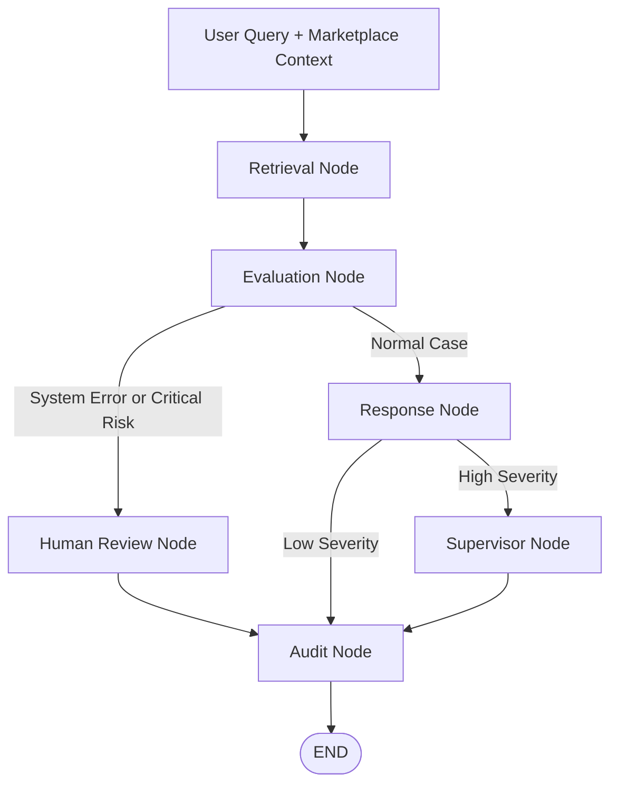

# ResolveFlow AI

**Multi-Agent Customer Support Triage System for Marketplace Disputes**

> Built with LangGraph, Gemini 2.5 Flash, Pinecone, and Streamlit
> Live Demo: [Insert your Streamlit Community Cloud URL here]

---

## Project Overview

C2C marketplace support teams need to resolve routine issues at scale while also detecting high-risk Trust & Safety cases such as fraud, off-platform payment attempts, account compromise, and high-value transaction disputes.

Simple FAQ bots or single-prompt LLM flows are not enough for this type of workflow. They often lack structured marketplace context, policy grounding, escalation rules, and safe fallback handling.

**ResolveFlow AI** is a production-style research PoC that simulates a multi-agent customer support triage pipeline using **LangGraph**. The system combines retrieved policy knowledge, marketplace risk signals, structured LLM outputs, and deterministic escalation rules to decide whether a case can be resolved automatically or should be escalated for human review.

The pipeline is designed around three practical support operations goals:

* Reduce unnecessary LLM calls for low-risk routine cases.
* Escalate high-risk marketplace disputes using explicit rules.
* Prevent silent failures by routing system errors or uncertain cases to manual review.

---

## Repository Structure

```text
ai-powered-customer-support-triage/
│
├── README.md                    # Project documentation and system overview
├── requirements.txt             # Python dependencies
├── app.py                       # Streamlit dashboard and LangGraph runtime
├── production.py                # Core application logic: state, schemas, and agent nodes
│
├── code/
│   └── ResolveFlow_AI.ipynb  # Full orchestration logic, prompts, and benchmarks
│
└── deck/
    └── Customer_Support_Triage.pdf
```

---

## Key Features

### 1. Dual-Namespace RAG

The system retrieves context from two Pinecone namespaces:

* `support-docs`: Platform policies, refund rules, and resolution criteria.
* `action-logs`: Historical supervisor decisions and prior case outcomes.

This separates static policy knowledge from operational memory, allowing agents to ground responses in both official rules and past handling patterns.

---

### 2. Rule-Based Escalation Guardrails

The evaluation node combines structured LLM reasoning with deterministic business rules.

Example escalation logic:

* High-value disputes are assigned a higher minimum severity.
* Users with repeated past disputes receive an additional risk adjustment.
* Mentions of off-platform payment, account hacking, or low seller ratings trigger Trust & Safety escalation.

This keeps critical marketplace risks from relying only on free-form LLM judgment.

---

### 3. Cost-Saving Early Exit

Low-severity cases can exit the workflow after response generation, bypassing supervisor review and additional audit steps.

This reduces unnecessary latency and token usage for routine inquiries while keeping higher-risk cases on a more controlled path.

---

### 4. Operational Circuit Breaker

The workflow includes fallback handling for API failures, rate limits, parsing errors, or unexpected evaluation failures.

When the system cannot safely complete the automated flow, the case is routed to a human review node with a safe customer acknowledgment instead of failing silently.

---

## Agent Pipeline



---

## Tech Stack

| Layer           | Tools            |
| --------------- | ---------------- |
| Orchestration   | LangGraph        |
| LLM             | Gemini 2.5 Flash |
| Embeddings      | Google GenAI SDK |
| Vector Database | Pinecone         |
| Data Validation | Pydantic         |
| UI              | Streamlit        |
| Language        | Python 3.10+     |

---

## Local Setup

### 1. Clone the repository

```bash
git clone https://github.com/yourusername/ai-powered-customer-support-triage.git
cd ai-powered-customer-support-triage
```

### 2. Install dependencies

```bash
pip install -r requirements.txt
```

### 3. Configure environment variables

```bash
export GEMINI_API_KEY="your-gemini-api-key"
export PINECONE_API_KEY="your-pinecone-api-key"
```

### 4. Launch the Streamlit app

```bash
streamlit run app.py
```

---

## Test Scenarios

The project includes simulated marketplace support cases covering both routine and high-risk flows:

* Standard refund policy question
* Low-value delivery dispute
* High-value transaction dispute
* Off-platform payment attempt
* Account compromise signal
* Repeated dispute history

These scenarios are used to validate routing behavior, escalation logic, and fallback handling.

---

## Future Improvements

| Priority | Item                    | Rationale                                                                            |
| -------- | ----------------------- | ------------------------------------------------------------------------------------ |
| P0       | PII Redaction Layer     | Mask sensitive customer data before sending content to the LLM.                      |
| P0       | FastAPI Endpoint        | Expose the LangGraph workflow as an async service.                                   |
| P1       | CRM Integration         | Sync outputs to Zendesk, Freshdesk, or another ticketing platform.                   |
| P1       | Human Feedback Loop     | Use manual review outcomes to improve severity classification.                       |
| P1       | Observability Dashboard | Track latency, escalation rate, fallback rate, and token usage.                      |
| P2       | Multilingual Support    | Support mixed-language marketplace messages such as Singlish, Bahasa, or Thai.       |
| P2       | Hybrid Search           | Combine dense vector retrieval with keyword search for exact order IDs or SKU terms. |

---

## Why This Project Matters

This project demonstrates how LLM workflows can be designed for operational decision-making instead of simple chatbot responses.

The focus is not only answer generation, but also:

* Structured state management
* Retrieval-grounded reasoning
* Rule-based escalation
* Cost and latency control
* Human fallback design
* Support operations safety

---

## Project Positioning

This project was built as a portfolio case study to demonstrate practical multi-agent workflow design for marketplace customer support operations.

It reflects problems commonly found in real support environments:

* High ticket volume
* Inconsistent manual routing
* Repeated policy lookups
* Trust & Safety escalation risks
* Cost and latency constraints in LLM workflows
* Need for human review on uncertain or high-impact cases

The goal is not to build a generic chatbot, but to show how an LLM-based workflow can be structured with retrieval, rules, routing logic, and fallback design.
